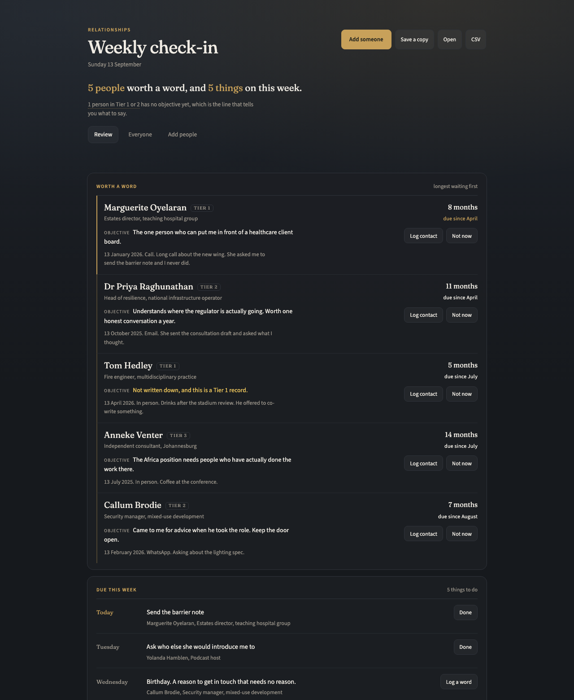

# Relationships

**A weekly check-in on the people you have decided are worth keeping.**

**Open it here:** [adriaanbosch.net/relationships](https://adriaanbosch.net/relationships/relationships.html)

No install, no account, no subscription. Click the link and it runs in your browser. adriaanbosch.net hands you the tool; it never sees what you put into it. Everything you type stays in your browser, on your device.



---

## The problem it was built for

A former intelligence officer, Julian Fisher, tells a story about moving house and finding a box holding thousands of business cards collected over thirty years. He pulled out five at random. He could not identify four of them and had no memory of meeting them. The fifth was an ex-girlfriend.

His verdict: all that networking, and he never did anything with it.

Most of us have that box. It is just digital now, so it is bigger and easier to ignore. The contacts are all still there. The relationships went quiet, and nothing told you it was happening, because nothing was watching.

This watches.

## What it is not

**It is not a sales tool.** No pipeline, no deals, no lead scoring, no forecast.

The clearest sign of that is a number most software would never put in: **a ceiling**. Every tier here has a range, and when you go past it the tool tells you. A sales tool is built to grow without limit. This one is built on the fact that your attention does not.

It also does not research anybody. No enrichment, no lookups, no agent going off to find out about your friends. What is in a record is what you know or what they told you. It does not read your mail, it does not touch your calendar, and it never sends anything to anyone. It tells you who is worth a word. You pick up the phone yourself, which is the part that cannot be automated and is the entire value of the exercise.

And there is no import. You add people one at a time, on purpose, because they are worth it. Loading your address book would just recreate the box of business cards inside the tool meant to replace it.

---

## How it works

Three ideas, and the first one carries the other two.

### The objective is the point

Every person gets one line on what you actually want from the relationship. It is required for your closest two tiers, and the tool keeps showing it as missing until you write it.

That single field is the difference between a contact and a relationship. "Met at a conference in 2019" is a card in a box. "Would open doors at three major developers, and I want one introduction this year" is something you can act on next Tuesday.

It is also what appears next to their name every week, so when the tool says somebody is worth a word, you already know what to say.

### The tier says how much, and how much is too much

Four tiers, with ranges rather than targets:

| Tier | Who | How many | Worth a word after |
|---|---|---|---|
| 1 | Inner circle | 5 to 10 | 3 months |
| 2 | Active | 25 to 50 | 6 months |
| 3 | Strategic | 50 to 150 | 12 months |
| 4 | Not placed | a waiting room | never, until you place them |

Those numbers come from Robin Dunbar, the anthropologist who found that the size of a social group a primate can hold together tracks the size of its neocortex. Applied to humans, the layers come out at roughly five intimates, fifteen close friends, fifty good friends and a hundred and fifty stable relationships. The point people miss is that these are **capacity limits, not goals**. They describe what your attention can actually carry, not what you should aim for.

So the tiers work in both directions. Being in Tier 1 means somebody gets more of you. Tier 1 holding fourteen people means nobody is getting enough, and the tool says so rather than congratulating you on the number.

Tier 4 is the waiting room. Somebody you have just met and have not decided about yet. Leave them there and after a month the tool points out that not deciding has become a decision.

### Time does the work

You do nothing and the list changes anyway, because the gap since you last spoke grows on its own.

Open it on a Monday and it tells you two things and nothing else: who is worth a word, and what is on this week. Five minutes. Then close it.

Each person shows how long it has been, when they fell due, and what you wanted from them. Log a contact in two taps and a sentence, and they drop off the list.

Birthdays appear in the week too. It is the one reason to get in touch that needs no reason attached to it.

---

## Getting started

1. Open [the tool](https://adriaanbosch.net/relationships/relationships.html). There is nothing to install.
2. Press **Show me an example** to see it with data in it, and clear it when you have looked.
3. Add your first real person.
4. Bookmark the link, and come back to it in the same browser.

**Want to check it never sends your data anywhere?** Once the page has opened, switch off your Wi-Fi and carry on. It still saves and still exports, because nothing in it needs the website to handle what you type.

Adding somebody takes under a minute: name, tier, and one line on what you want. Everything else can wait.

**Adding a lot of people** is a sitting rather than a form. Open **Add people** and the box stays put: type, press Enter, and it clears itself and waits for the next one, keeping your tier and date. What you have added builds up underneath as you go.

### The LinkedIn shortcut

In **Add people** there is a link you drag to your bookmarks bar once. On somebody's profile, click it. Their name, headline, organisation, location, profile link, connection degree and mutual connections go to your clipboard, ready to paste in.

Mutual connections is the one worth having. Nobody types that by hand, and who else already knows somebody is how an introduction actually gets asked for.

It reads only the page you already have open, about a person you chose to look at, because you clicked. It fetches nothing and sends nothing anywhere. The text goes to your clipboard and no further.

It is written against how LinkedIn lays out a profile today, so it will need a new version when they rearrange things. The paste box works on its own regardless, so the worst case is copying by hand.

---

## Your data

**The file you export is the record. The browser is a cache.**

What you add is kept in the browser you used, on the device you used. A work laptop and a home laptop are two separate stores, and a private window forgets everything when you close it. If you clear your browser's data for adriaanbosch.net, the tool's data goes with it.

Press **Save a copy** and you get a JSON file with everything in it. That file is the backup, and the tool nags you when the last one is old. **Open** restores it, and reconciles as it goes: how many records were in the file, how many were read in, what was left out and why, what was kept with a value changed, and the first and last record so you can check the ends.

**CSV** gives you the whole thing as a spreadsheet, so you are never locked in.

A file that claims to be from a different tool is refused, and nothing is changed.

## Privacy, and how to check it rather than trust it

There are no network calls of any kind. No analytics, no telemetry, no fonts, no CDN, no sync, no sign-in.

You do not have to take that on faith, which is the part that matters. With the tool open, right-click the page, choose **View Page Source**, and search for these three:

```
fetch(          XMLHttpRequest          WebSocket
```

Those are the ways a web page asks the internet for something. There are none of them in here, and the page does not name them anywhere either, so a search really does come back empty.

Search for `http` as well and you will find exactly one, and it is not a request. It is a pattern that recognises a web address inside text you paste in, so it can put somebody's profile link in the right box.

That is a claim you can settle yourself in under a minute, which is rare in software. Switching off the Wi-Fi, above, is the same check without reading anything.

It follows that your data lives in your browser's storage and in the files you export. Nobody else has a copy, including whoever wrote this. If you clear your browser data without exporting first, it is gone.

---

## Requirements

A browser, and a connection to open the page. Once it is open it keeps working without one.

It is built for a desktop or laptop and there is no phone version, on purpose. Capture on the move belongs in a note or a message to yourself; entry happens when you sit down. One copy of the data, nothing to sync, and the small amount of friction is the price of that.

## Credit

The framework is Julian Fisher's OTTERS: objective, targeting, trust, elicitation, recruitment, stewardship. The objective field, the tiering and the whole idea of stewardship as a stage rather than an afterthought come from his work.

The capacity numbers are Robin Dunbar's.

## Licence

MIT.
